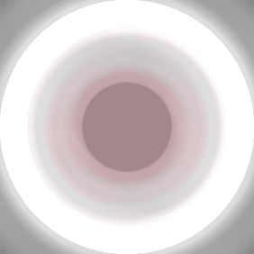

# Mono-Match-Mystic

*Matthew Merrill 2021*

**Can't find the icon shared by two pentagons?**
Let your computer find it for you!

**Requires pillow and numpy to be installed.** Pillow is used for image manipulation and opening the cards in a pop-up
window to display the results. Numpy is used for calculating the Mean-Squared Error of two images.

### Find match across two cards

`python3 main.py find_match path/to/card1.png path/to/card2.png`

### Find all matches shared across a set of cards

`python3 main.py find_matches path/to/card1.png path/to/card2.png path/to/card3.png`

### Why?

To solve the card game made by Matt Parker as part of his "The Maths Of Dobble" video! Patreons were sent cards to solve, and my set of
cards proved difficult to verify. I figured writing a program would be faster (and maybe a bit more fun).

### How does it work?

Each icon is extracted from the original image then blurred by rotating it in a circle and blending all the rotations.

Then, the blurred icons are compared against each other in N^2, brute force glory.
The two blurred icons with the lowest Mean-Squared Error are very likely the matching icons.
For my cards, this worked perfectly!
